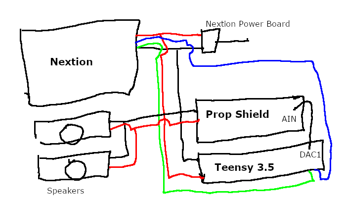
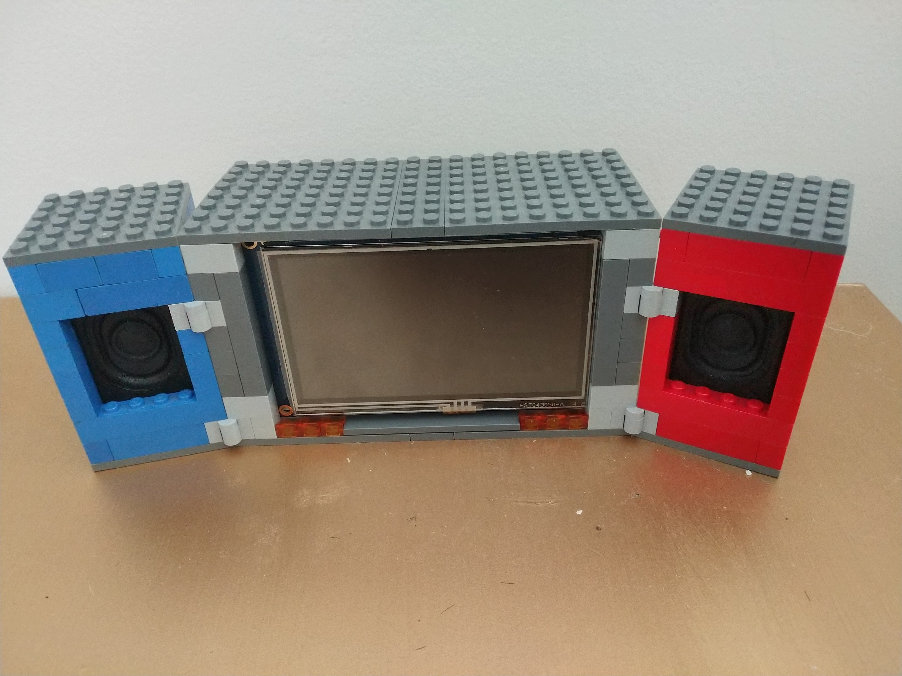
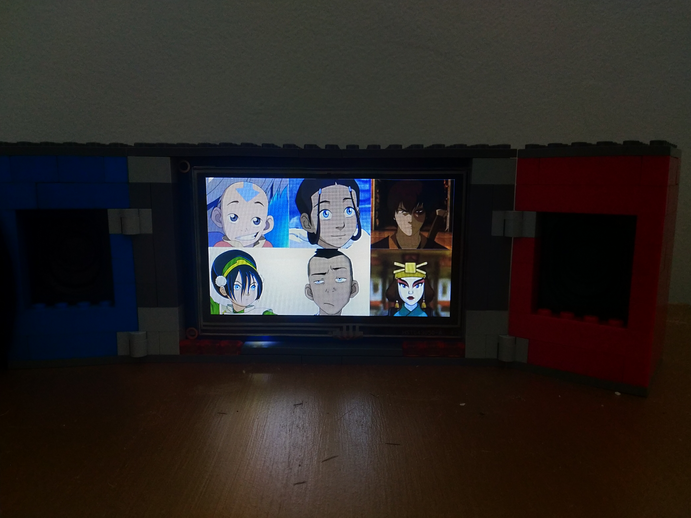

## AVATAR BOX

This project was pretty simple. I made a sound box for my partner who loves ATLA.

Its realatively cheap and easy to make.

### Materials

+ [Nextion 4.3" Basics Series Touch Display](https://itead.cc/product/nx4827t043-nextion-4-3-basic-series-hmi-touch-display/) (Although you can use any touch Nextion Touch Display, the HMI File here is sized to the 4.3")
+ [Teensy 3.5](https://www.pjrc.com/store/teensy35.html) (You could use 3.2 or 3.6, as long as there is a DAC pin)
+ [Teensy Prop Shield](https://www.pjrc.com/store/prop_shield.html) (could also use the audio board. See below)
+ MicroSD card  (used to play audio. May need another to flash Nextion image)
+ 4 or 8 Ohm Speakers (I used two 3W 8 Ohm speakers found [here](https://www.amazon.com/CQRobot-JST-PH2-0-Interface-Electronic-Projects/dp/B0738NLFTG/)
+ Legos (to make case, you can use whatever you want though)

**NOTE on Teensy Materials**: The prop shield is to be mounted onto the teensy MCU however: if using 3.5 or 3.6 MCU, an additional wire needs to be added from the MCU's DAC1 pin to the prop shields AUDIOIN pin. Additionally, you **can not** use the LC version of the prop shield as the audio library does not support the LCC version (although some say you can use [this](https://github.com/PaulStoffregen/AudioZero) modified AudioZero lirbary)

### Construction

Contrsuction is easy
+ Attach the speaker's (+) and (-) wires to the (+) and (-) pins on the prop shield.
+ Mount the prop shield onto the teensy MCU (you may need an additional wire mentioned in the NOTE)
+ Nextion display should have 4 wires. Attach the Nextion's RX wire to the Teensy's TX pin and then attach the Nextion's TX wire to the Teensy's RX pin. I used the Teensy 3.5's Serial 4 RX and TX pins.
+ The remaining Nextion wires should be power and ground. Nextion should supply it's own power board to help regulate power to the display. Connect the Nextion's power cables to this power board. Then you can hijack the (+) and (-) the power board to attach to teensy MUC VIN and GND pins repsectivly (don't ground to audio ground).

See 

### Software

You will need the SerialFlash, SD, SPI, Wire, and Audio Libraries. You don't actually need the Nextion Library.
Install the `avatarbox.HMI` file to the Nextion board and upload `avatarbox.ino` to the teensy board. You wil probably need to install the teensy installer.

### Audio

I then took a bunch of audio clips from the ATLA show and put them on the microSD card and put that card into the teensy.
I did a lazy dumb naming convention of `[index][track].WAV` and then assigned each person an index. So suppose Aang's index was 0. So his first audio clip was named `00.WAV` and his fifth audio track was `04.WAV`.

### Controls

Its simple. Tap the person you want to hear a voice line from. Tap the far left and far right sides to find more people.

## Final Work

TADA!!

